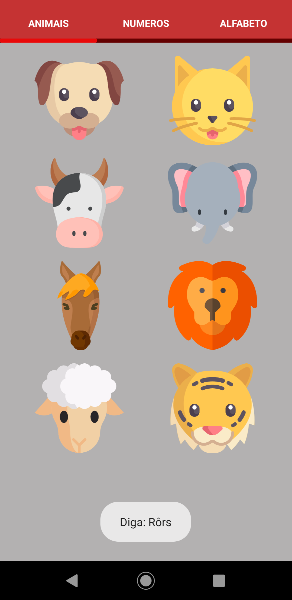
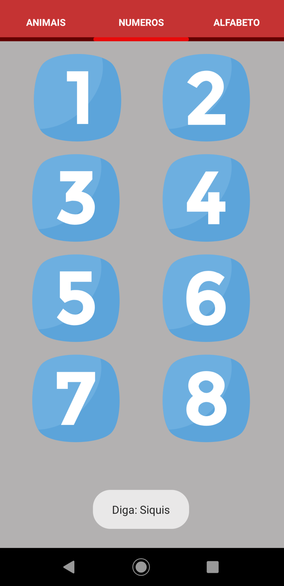
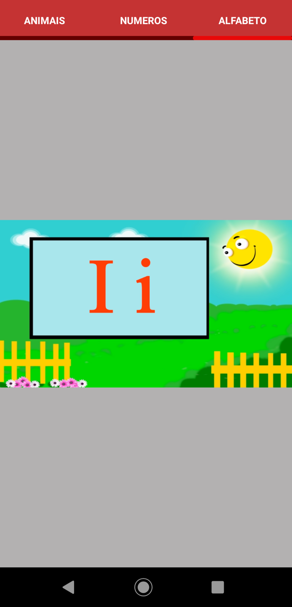

# Aprenda Inglês - Projeto

 
 

  

# Sobre o projeto
#### Este é mais um projeto do curso de [Desenvolvimento Android Completo - Aprenda a criar 18 apps](https://www.udemy.com/course/curso-de-desenvolvimento-android-oreo/). O funcionamento do App é bem simples, o usuário seleciona uma imagem e é retornada a ele a pronúncia em inglês, e também retorna uma pronuncia "Aportuguesada" pelo Toast,e com esse App, aprendi a implementar:

* Execução de vídeos e sons.
* Abas, com a dependência [SmartTabLayout](https://github.com/ogaclejapan/SmartTabLayout).
* interface de fragments.

# Screenshots
##### **Obs: a última screenshot é de um vídeo com a música do alfabeto em inglês**
 

# Pontos a melhorar
* Quando o usuário der play no vídeo, automaticamente, abrir em tela cheia.
* Estilização do App.

# Créditos
##### As imagens utilizadas no app foram retiradas do site [Flaticon.com](https://www.flaticon.com)
##### [Vídeo da música do alfabeto](https://www.youtube.com/watch?v=oGg58pVW1B0)
